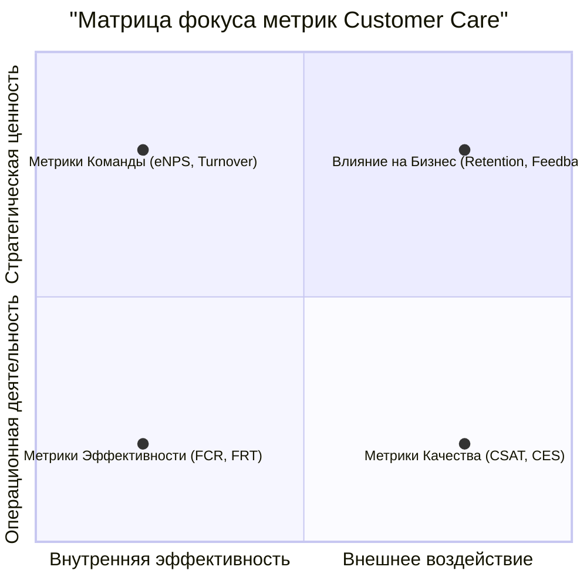

Оценка работы подразделения Customer Care (заботы о клиентах) — это не просто подсчет закрытых заявок, а комплексный процесс, который должен учитывать эффективность, качество и влияние на бизнес.

Ключевой принцип: **нельзя управлять тем, что нельзя измерить**. Поэтому оценка должна быть основана на системе сбалансированных метрик (KPI).

Вот структурированный подход к оценке, разделенный на четыре ключевых блока:

---

### 1. Метрики Эффективности (Операционные KPI) — «Как быстро мы работаем?»
Эти метрики отвечают за скорость и объем обработки запросов. Они важны для планирования нагрузки и оценки производительности, но не отражают качество обслуживания.

*   **First Contact Resolution (FCR) — Первичное разрешение:** % обращений, решенных при первом контакте, без необходимости повторного обращения клиента по той же проблеме.
    *   **Что показывает:** Высокий FCR — признак компетентности сотрудников и хорошей Базы Знаний. Низкий FCR ведет к frustration клиента и росту нагрузки.
*   **First Response Time (FRT) — Время первого ответа:** Среднее время, за которое клиент получает первый ответ на свой запрос (в любом канале).
    *   **Что показывает:** Уважение к времени клиента. Даже если проблема не решена мгновенно, клиент понимает, что его запрос принят в работу.
*   **Average Handle Time (AHT) — Среднее время обработки:** Среднее время, затрачиваемое на один запрос (включает разговор, удержание, последующие действия).
    *   **Важно:** Не гнаться за минимизацией AHT любой ценой. Иногда лучше потратить больше времени и решить проблему качественно (повысить FCR), чем быстро "отделаться" и получить повторное обращение.
*   **Resolution Time — Время решения:** Среднее время, необходимое для полного решения проблемы клиента.
*   **Объем обращений:** Количество обращений в единицу времени (день, неделя, месяц). Анализ динамики помогает планировать штатное расписание.

---

### 2. Метрики Качества (Качественные KPI) — «Насколько хорошо мы работаем?»
Это самые важные метрики, так как они directly отражают удовлетворенность клиента.

*   **Customer Satisfaction Score (CSAT / CES):** Оценка клиента после закрытия обращения (например, по шкале от 1 до 5 или 1 до 10 на вопрос "Насколько вы довольны помощью?").
    *   **Что показывает:** Непосредственную реакцию на конкретный опыт взаимодействия.
*   **Customer Effort Score (CES):** Оценка того, насколько клиенту было легко решить свою проблему (например, "Компания сделала решение моей проблемы простым и effortless").
    *   **Что показывает:** Современный тренд. Клиенты ценят удобство и простоту больше, чем "восторг".
*   **Качество коммуникации (QA Score):** Регулярная выборочная проверка менеджером или QA-специалистом переписки, звонков (записей разговоров) по чек-листу.
    *   **Критерии:** вежливость, эмпатия, активное слушание, соблюдение скриптов, грамотность, точность диагностики.

---

### 3. Метрики Влияния на Бизнес — «Какую ценность мы приносим компании?»
Эти метрики связыва работу поддержки с бизнес-результатами.

*   **Customer Retention & Churn Rate — Удержание и отток:** Анализ связи между обращением в поддержку и последующим уходом клиента (или наоборот, продлением подписки). Своевременное решение проблемы удерживает клиентов.
*   **NPS (Net Promoter Score) — Лояльность:** Насколько клиенты готовы рекомендовать вашу компанию другим. Хотя NPS — метрика всей компании, можно отслеживать корреляцию между обращением в поддержку и изменением NPS-оценки клиента.
*   **Количество эскалаций:** Сколько проблем потребовало перевода на второй или третий уровень поддержки. Высокий показатель может указывать на проблемы в обучении сотрудников первого уровня или в продукте.
*   **Выявление trends и feedback продукту:** Насколько эффективно поддержка собирает и передает product-team частые запросы, баги и идеи по улучшению продукта от клиентов. Это превращает поддержку из затратного центра в источник ценной информации.

---

### 4. Метрики Команды — «Эффективны и довольны ли наши сотрудники?»
Довольные сотрудники = довольные клиенты. Выгорание в поддержке — огромная проблема.

*   **Employee Satisfaction (eNPS):** Уровень удовлетворенности и лояльности самих сотрудников поддержки.
*   **Текучесть кадров (Turnover Rate):** Высокая текучка — тревожный сигнал о проблемах с процессами, нагрузкой или руководством.
*   **Загрузка (Utilization Rate):** % рабочего времени, которое сотрудник тратит на активную работу с клиентами. Позволяет оптимально планировать штат и избегать выгорания.

### Как внедрить систему оценки: Практические шаги

1.  **Определите цели:** Что для вас важнее всего? Скорость, качество, удержание клиентов?
2.  **Выберите 5-7 ключевых метрик** из разных блоков. Не пытайтесь измерять всё сразу. Стартовый набор: **FCR, CSAT, Среднее время решения, кол-во эскалаций, eNPS**.
3.  **Внедрите инструменты для сбора данных:**
    *   **Helpdesk-система** (Zendesk, Freshdesk, Jira Service Management) для операционных метрик.
    *   **Опросы** (после закрытия тикета, через email или чат-виджет) для CSAT/CES.
    *   **Регулярные внутренние опросы** для eNPS.
    *   **CRM-система** для анализа оттока.
4.  **Анализируйте и действуйте:**
    *   **Регулярно** (еженедельно/ежемесячно) проводите встречи по анализу метрик.
    *   **Делитесь** результатами с командой.
    *   **Ищите root-cause** проблем. Низкий CSAT? Копайте глубже: может, это из-за частой эскалации или долгого времени ответа.
    *   **Внедряйте изменения** на основе данных: обновите базу знаний, проведите дополнительное обучение, измените процесс эскалации.

Графическое представление этой системы метрик может выглядеть так:

Таким образом, оценка работы подразделения Customer Care — это всегда **баланс** между операционной эффективностью, качеством сервиса, impact на бизнес и благополучием команды.