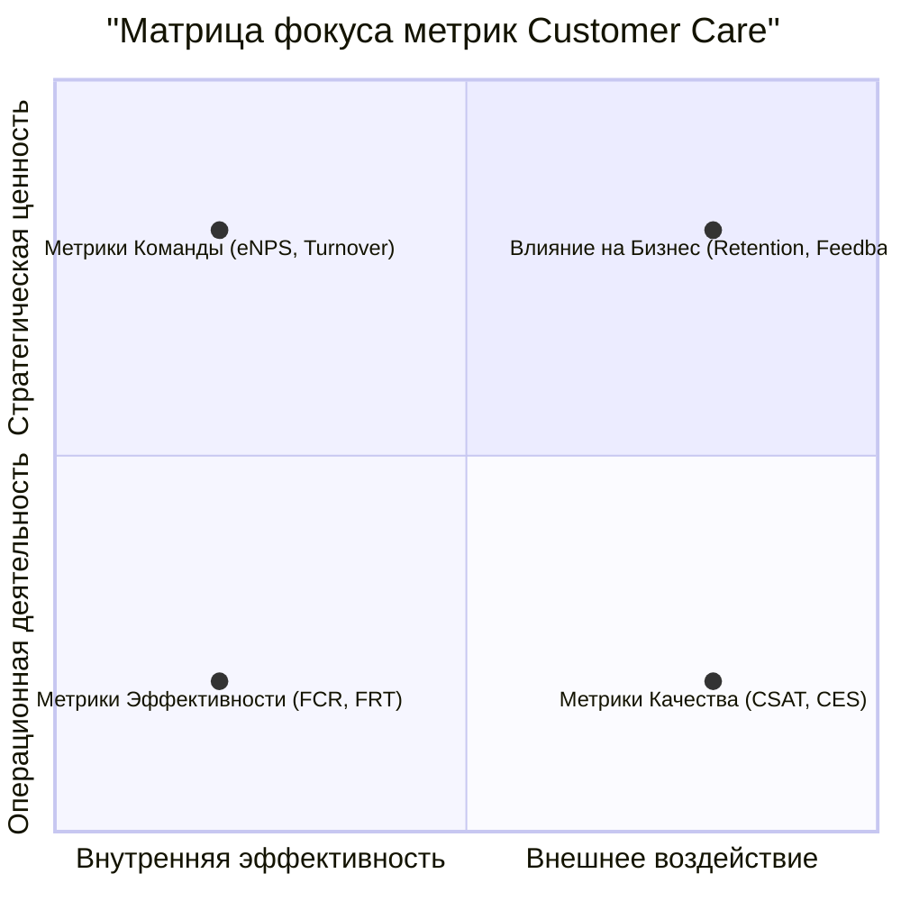

Оценка работы подразделения Customer Care (заботы о клиентах) — это не просто подсчет закрытых заявок, а комплексный процесс, который должен учитывать эффективность, качество и влияние на бизнес.

Ключевой принцип: **нельзя управлять тем, что нельзя измерить**. Поэтому оценка должна быть основана на системе сбалансированных метрик (KPI).

Вот структурированный подход к оценке, разделенный на четыре ключевых блока:

---

### 1. Метрики Эффективности (Операционные KPI) — «Как быстро мы работаем?»
Эти метрики отвечают за скорость и объем обработки запросов. Они важны для планирования нагрузки и оценки производительности, но не отражают качество обслуживания.

*   **First Contact Resolution (FCR) — Первичное разрешение:** % обращений, решенных при первом контакте, без необходимости повторного обращения клиента по той же проблеме.
    *   **Что показывает:** Высокий FCR — признак компетентности сотрудников и хорошей Базы Знаний. Низкий FCR ведет к frustration клиента и росту нагрузки.
*   **First Response Time (FRT) — Время первого ответа:** Среднее время, за которое клиент получает первый ответ на свой запрос (в любом канале).
    *   **Что показывает:** Уважение к времени клиента. Даже если проблема не решена мгновенно, клиент понимает, что его запрос принят в работу.
*   **Average Handle Time (AHT) — Среднее время обработки:** Среднее время, затрачиваемое на один запрос (включает разговор, удержание, последующие действия).
    *   **Важно:** Не гнаться за минимизацией AHT любой ценой. Иногда лучше потратить больше времени и решить проблему качественно (повысить FCR), чем быстро "отделаться" и получить повторное обращение.
*   **Resolution Time — Время решения:** Среднее время, необходимое для полного решения проблемы клиента.
*   **Объем обращений:** Количество обращений в единицу времени (день, неделя, месяц). Анализ динамики помогает планировать штатное расписание.

---

### 2. Метрики Качества (Качественные KPI) — «Насколько хорошо мы работаем?»
Это самые важные метрики, так как они directly отражают удовлетворенность клиента.

*   **Customer Satisfaction Score (CSAT / CES):** Оценка клиента после закрытия обращения (например, по шкале от 1 до 5 или 1 до 10 на вопрос "Насколько вы довольны помощью?").
    *   **Что показывает:** Непосредственную реакцию на конкретный опыт взаимодействия.
*   **Customer Effort Score (CES):** Оценка того, насколько клиенту было легко решить свою проблему (например, "Компания сделала решение моей проблемы простым и effortless").
    *   **Что показывает:** Современный тренд. Клиенты ценят удобство и простоту больше, чем "восторг".
*   **Качество коммуникации (QA Score):** Регулярная выборочная проверка менеджером или QA-специалистом переписки, звонков (записей разговоров) по чек-листу.
    *   **Критерии:** вежливость, эмпатия, активное слушание, соблюдение скриптов, грамотность, точность диагностики.

---

### 3. Метрики Влияния на Бизнес — «Какую ценность мы приносим компании?»
Эти метрики связыва работу поддержки с бизнес-результатами.

*   **Customer Retention & Churn Rate — Удержание и отток:** Анализ связи между обращением в поддержку и последующим уходом клиента (или наоборот, продлением подписки). Своевременное решение проблемы удерживает клиентов.
*   **NPS (Net Promoter Score) — Лояльность:** Насколько клиенты готовы рекомендовать вашу компанию другим. Хотя NPS — метрика всей компании, можно отслеживать корреляцию между обращением в поддержку и изменением NPS-оценки клиента.
*   **Количество эскалаций:** Сколько проблем потребовало перевода на второй или третий уровень поддержки. Высокий показатель может указывать на проблемы в обучении сотрудников первого уровня или в продукте.
*   **Выявление trends и feedback продукту:** Насколько эффективно поддержка собирает и передает product-team частые запросы, баги и идеи по улучшению продукта от клиентов. Это превращает поддержку из затратного центра в источник ценной информации.

---

### 4. Метрики Команды — «Эффективны и довольны ли наши сотрудники?»
Довольные сотрудники = довольные клиенты. Выгорание в поддержке — огромная проблема.

*   **Employee Satisfaction (eNPS):** Уровень удовлетворенности и лояльности самих сотрудников поддержки.
*   **Текучесть кадров (Turnover Rate):** Высокая текучка — тревожный сигнал о проблемах с процессами, нагрузкой или руководством.
*   **Загрузка (Utilization Rate):** % рабочего времени, которое сотрудник тратит на активную работу с клиентами. Позволяет оптимально планировать штат и избегать выгорания.

### Как внедрить систему оценки: Практические шаги

1.  **Определите цели:** Что для вас важнее всего? Скорость, качество, удержание клиентов?
2.  **Выберите 5-7 ключевых метрик** из разных блоков. Не пытайтесь измерять всё сразу. Стартовый набор: **FCR, CSAT, Среднее время решения, кол-во эскалаций, eNPS**.
3.  **Внедрите инструменты для сбора данных:**
    *   **Helpdesk-система** (Zendesk, Freshdesk, Jira Service Management) для операционных метрик.
    *   **Опросы** (после закрытия тикета, через email или чат-виджет) для CSAT/CES.
    *   **Регулярные внутренние опросы** для eNPS.
    *   **CRM-система** для анализа оттока.
4.  **Анализируйте и действуйте:**
    *   **Регулярно** (еженедельно/ежемесячно) проводите встречи по анализу метрик.
    *   **Делитесь** результатами с командой.
    *   **Ищите root-cause** проблем. Низкий CSAT? Копайте глубже: может, это из-за частой эскалации или долгого времени ответа.
    *   **Внедряйте изменения** на основе данных: обновите базу знаний, проведите дополнительное обучение, измените процесс эскалации.

Графическое представление этой системы метрик может выглядеть так:

Таким образом, оценка работы подразделения Customer Care — это всегда **баланс** между операционной эффективностью, качеством сервиса, impact на бизнес и благополучием команды.

## Формула для оценки работы Customer Care
Создание единой формулы для оценки работы Customer Care — это сложная, но выполнимая задача. Такой подход позволяет получить агрегированный, количественный показатель эффективности, который легко отслеживать в динамике.

На основе вышеизложенных принципов, я предложу **многофакторную формулу**, которая балансирует ключевые аспекты: **качество, эффективность, бизнес-impact и команду**.

---

### Общий вид формулы (Индекс Эффективности Customer Care — CCEI)

**CCEI = (W₁ × Quality_Score) + (W₂ × Efficiency_Score) + (W₃ × Business_Score) + (W₄ × Team_Score)**

Где:
*   **CCEI (Customer Care Effectiveness Index)** — итоговый показатель эффективности (0-100% или в баллах).
*   **W₁, W₂, W₃, W₄** — весовые коэффициенты для каждого компонента (в сумме должны давать 1). Их распределение зависит от стратегических приоритетов компании.
*   **Quality_Score, Efficiency_Score, etc.** — рассчитанные показатели для каждого блока, нормализованные к единой шкале (например, 0-100).

---

### Детализация каждого компонента формулы

#### 1. Quality Score (Индекс Качества) — *"Насколько мы хороши?"*
**Рекомендуемый вес (W₁): 0.3 - 0.4** (самый высокий приоритет)
**Formula = (CSAT × 0.5) + (CES × 0.3) + (FCR × 0.2)**

*   **CSAT (Customer Satisfaction Score):** % положительных оценок (4 и 5 из 5) от всех полученных.
*   **CES (Customer Effort Score):** % клиентов, ответивших "очень легко" (или 5 из 5) на вопрос о простоте решения их проблемы.
*   **FCR (First Contact Resolution):** % обращений, решенных с первого раза.

*Пояснение: Веса внутри компонента можно менять. CSAT — прямая оценка, поэтому он имеет наибольший вес.*

#### 2. Efficiency Score (Индекс Эффективности) — *"Как быстро мы работаем?"*
**Рекомендуемый вес (W₂): 0.2 - 0.3**
**Formula = (Target_FRT / Avg_FRT × 0.4) + (Target_AHT / Avg_AHT × 0.3) + (Target_Resolution_Time / Avg_Resolution_Time × 0.3) × 100**

*   **Avg_FRT (Average First Response Time):** Среднее время первого ответа.
*   **Target_FRT:** Целевое (плановое) время первого ответа.
*   **Avg_AHT (Average Handle Time):** Среднее время обработки обращения.
*   **Target_AHT:** Целевое время обработки.
*   **Avg_Resolution_Time:** Среднее время полного решения.
*   **Target_Resolution_Time:** Целевое время решения.

*Пояснение: Эта формула поощряет не просто скорость, а достижение целевых показателей. Если фактическое время лучше целевого, компонент будет >100.*

#### 3. Business Score (Бизнес-Индекс) — *"Какое наше влияние?"*
**Рекомендуемый вес (W₃): 0.2 - 0.3**
**Formula = (Retention_Rate_Influence × 0.5) + (Feedback_Quality_Score × 0.5)**

*   **Retention_Rate_Influence:** Сравнение уровня удержания клиентов, обращавшихся в поддержку, с общим уровнем удержания. Например: `(Retention_After_Support_Contact / Overall_Retention_Rate) × 100`.
*   **Feedback_Quality_Score:** Оценка работы отдела по передаче обратной связи продукту. Можно считать как % реализованных или принятых к работе ценных предложений от поддержки, либо как количество переданных идей в месяц (нормализованное до шкалы 0-100).

#### 4. Team Score (Индекс Команды) — *"Здорова ли наша команда?"*
**Рекомендуемый вес (W₄): 0.1 - 0.2**
**Formula = (eNPS × 0.6) + (1 - Turnover_Rate) × 100 × 0.4)**

*   **eNPS (Employee Net Promoter Score):** Показатель лояльности сотрудников.
*   **Turnover_Rate:** Коэффициент текучести кадров в подразделении за период.

*Пояснение: Этот компонент показывает, что инвестиции в команду — это инвестиции в качество.*

---

### Пример расчета с вымышленными данными:

**Допустим, приоритеты компании: Качество (40%), Эффективность (25%), Бизнес (25%), Команда (10%).**
*Веса: W₁=0.4, W₂=0.25, W₃=0.25, W₄=0.1*

**1. Quality_Score:**
*   CSAT = 90% (0.9)
*   CES = 85% (0.85)
*   FCR = 75% (0.75)
*   *Score = (0.9*0.5) + (0.85*0.3) + (0.75*0.2) = 0.45 + 0.255 + 0.15 = **0.855***

**2. Efficiency_Score:**
*   Target_FRT = 2 мин, Avg_FRT = 1.5 мин -> (2/1.5)=1.33
*   Target_AHT = 10 мин, Avg_AHT = 12 мин -> (10/12)=0.83
*   Target_Res_Time = 24 ч, Avg_Res_Time = 20 ч -> (24/20)=1.2
*   *Score = (1.33*0.4) + (0.83*0.3) + (1.2*0.3) = 0.532 + 0.249 + 0.36 = **1.141***
*   Нормализуем до шкалы качества: 1.141 * 100 = **114.1**

**3. Business_Score:**
*   Retention Rate Influence: Удержание после поддержки = 88%, общее удержание = 80% -> (88/80)*100 = **110**
*   Feedback_Quality_Score (оценочно, по шкале до 100): **80**
*   *Score = (110*0.5) + (80*0.5) = 55 + 40 = **95***

**4. Team_Score:**
*   eNPS = 50
*   Turnover_Rate = 10% (0.1) -> (1 - 0.1)*100 = 90
*   *Score = (50*0.6) + (90*0.4) = 30 + 36 = **66**

**ФИНАЛЬНЫЙ РАСЧЕТ CCEI:**
**CCEI = (0.4 × 85.5) + (0.25 × 114.1) + (0.25 × 95) + (0.1 × 66)**
**CCEI = 34.2 + 28.525 + 23.75 + 6.6 = 93.075**

**Итог:** Общий индекс эффективности поддержки составляет **93.1 из 100 возможных**. Это отличный результат. Анализируя компоненты, мы видим, что команда (66) — слабое место, несмотря на высокую эффективность (114.1). Это ценный insight для менеджера: нужно работать с мотивацией и удержанием сотрудников, чтобы не пострадало качество в будущем.

Эта формула — гибкий инструмент. Вы можете менять метрики внутри компонентов и их веса, чтобы наилучшим образом отражать цели вашей компании.

[Калькулятор CCEI](https://codeecod.github.io/CCEI/)
